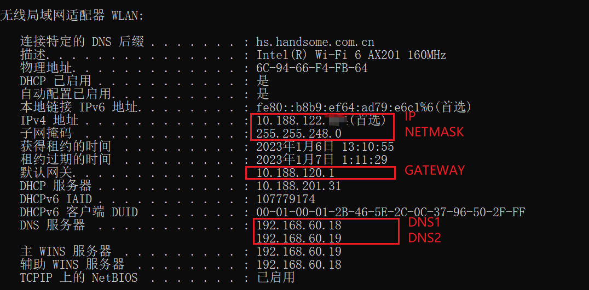
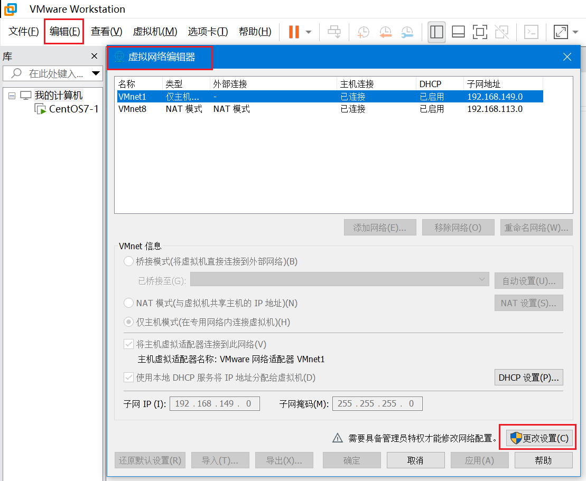
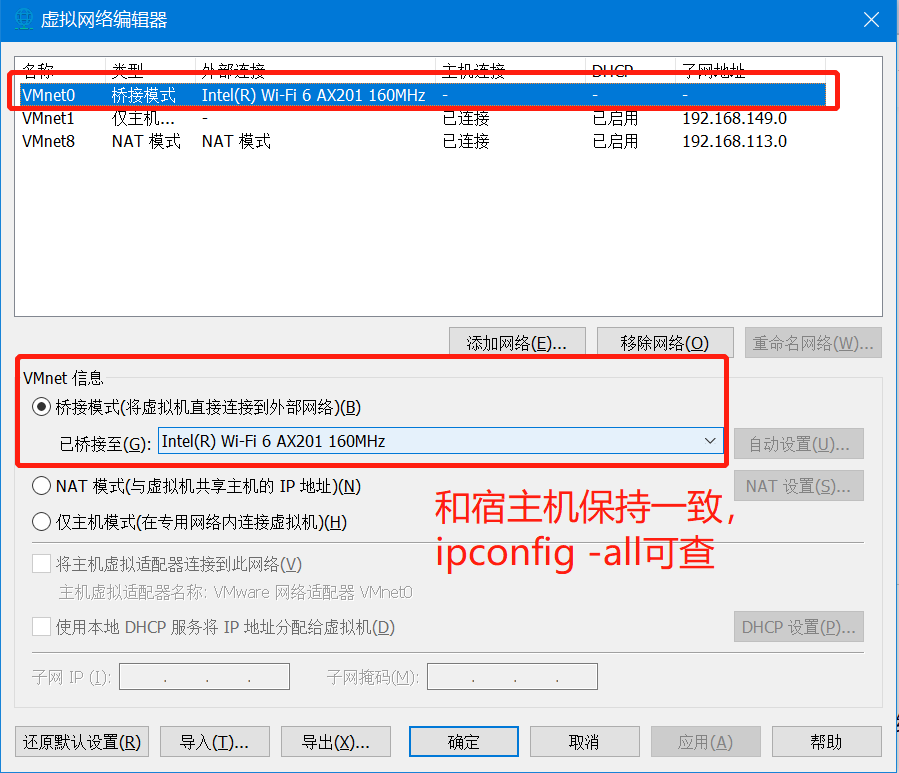
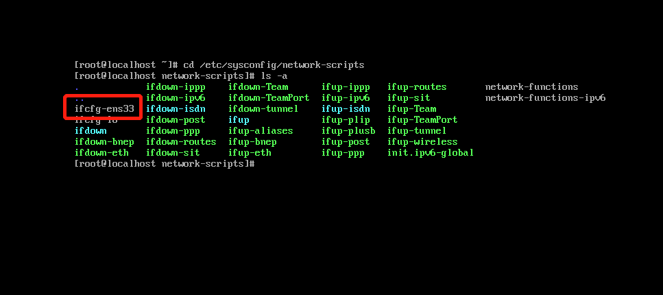
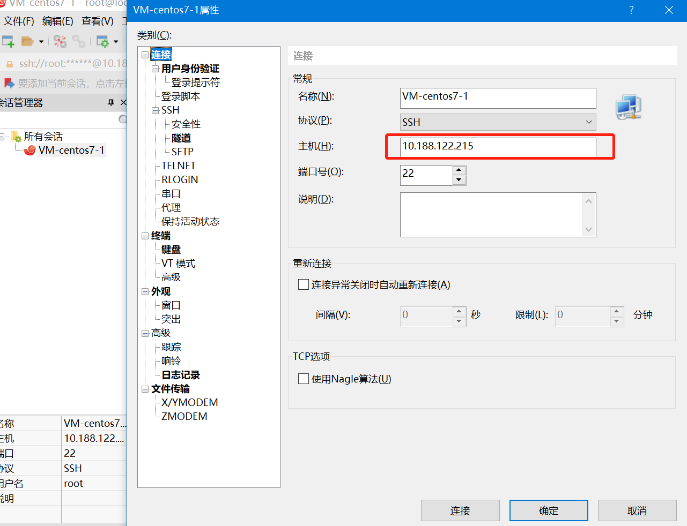

### VMWare16 桥接网络配置

一 环境清单
1. VMWare 16
2. 虚拟机：Centos7
3. 宿主机：Windows 10

二 配置过程
1. 查看宿主机的IP相关信息  
``` 
ipconfig -all 
```


2. 配置虚拟网络编辑器  
打开VMware Workstation Pro，点击左上角编辑-->虚拟网络编辑器
  

点击更改配置


编辑虚拟机设置


3. 启动虚拟机centos7

4. 修改配置文件ifcfg-ens33


```
TYPE="Ethernet"
PROXY_METHOD="none"
BROWSER_ONLY="no"
#BOOTPROTO="dhcp"
DEFROUTE="yes"
IPV4_FAILURE_FATAL="no"
IPV6INIT="yes"
IPV6_AUTOCONF="yes"
IPV6_DEFROUTE="yes"
IPV6_FAILURE_FATAL="no"
IPV6_ADDR_GEN_MODE="stable-privacy"
NAME="ens33"
UUID="ac9b66bf-74fb-4bda-b89f-c66ff84c9571"
DEVICE="ens33"
#ONBOOT="no"
#配置静态地址
#ONBOOT="yes"
BOOTPROTO="static"
IPADDR=10.188.122.215   
NETMASK=255.255.248.0
GATEWAY=10.188.120.1
DNS1=192.168.60.18
DNS2=192.168.60.19
```
5.重启网络
``` 
systemctl restart network
```
6.PING虚拟机ip/宿主机ip
```
ping 10.188.122.215
ping 10.188.122.214
ping www.baidu.com
```
7.安装net-tools
```
yum install net-tools
```
8.xshell链接虚拟机


