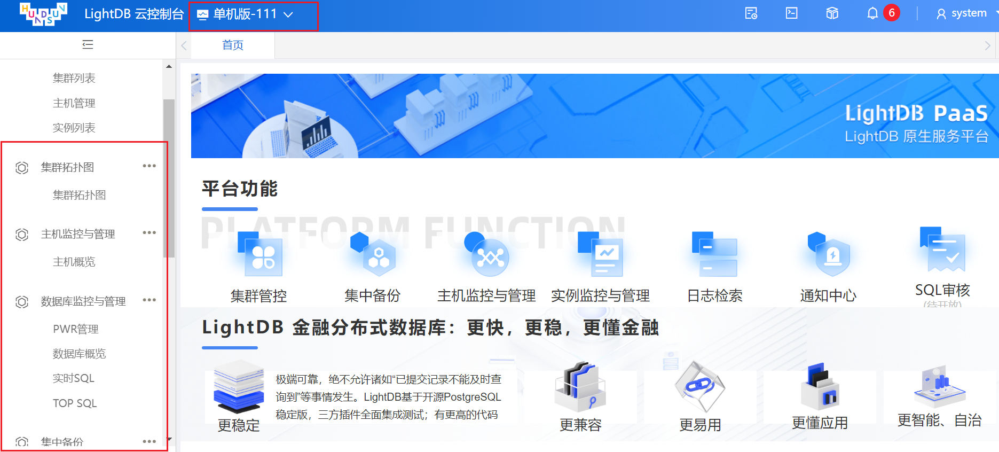

### LightDB Agent安装

#### 简介
LightDB Enterprise Manager（即 LightDB数据库监控管理平台，下文均简称为LightDB EM）是一个综合性的数据库监控和管理系统，
旨在满足数据库用户的需求，提供强大的图形界面，简化了对LightDB数据库的维护和使用。  

LightDB Agent用于代理服务器和数据库实例，可以在EM图形化界面上进行安装。

#### 解释
| 名称        | 说明           | 作用  |  
| ----       | ----          | ---- |
|LightDB EM  | Java 应用      | 可视化监控管理平台 |
|LightDB Agent| Java 应用     | 服务器主机/数据库实例代理 |
|LightDB      | 数据库应用      | 数据库服务 |


#### Agent包下载
```sql
下载地址：http://www.light-pg.com/downloadCate.html
EM版本：lightdb-em-13.8-22.4-932edbddb-el7.x86_64.zip
Agent版本：lightdb-agent-13.8-22.4-932edbddb-el7.x86_64.zip

个人环境说明：
操作系统：centos-7
lightdb安装模式：单机模式
个人服务器地址：192.168.121.111
一些安装路径：
[root@localhost config]# cd /usr/local/lightdb
[root@localhost lightdb]# ll
总用量 0
drwxrwxr-x  2 lightdb lightdb   6 1月  31 11:11 agent (ps:在em操作台上添加agent之后生成)
drwxr-xr-x 14 lightdb lightdb 208 1月  31 10:02 em
drwxrwxr-x  9 lightdb lightdb 140 1月   9 18:00 jdk
drwxrwxr-x  3 lightdb lightdb  23 1月   9 17:59 lightdb-x
drwxr-x---  3 lightdb lightdb  23 1月  19 03:09 lightdb-x-for-em (ps: lightdb绿色版,用于监控数据的收集)
drwxrwxr-x  3 lightdb lightdb 107 1月   9 18:00 uninstall
```

#### 目标
以下操作我这边都放在了192.168.121.111服务器上，实际操作中可根据情况调整。  
在不同服务器上安装组件注意(em和agent要使用同一个redis，agent安装在要监控的主机上)
1. 安装单机版本lightdb,已完成。(参考->[单机安装](https://github.com/KvApril/LightDBAbout/blob/main/2023-01-06%20LightDB%E5%8D%95%E6%9C%BA%E5%AE%89%E8%A3%85.md))  
2. 安装EM监控管理平台,已完成。(参考->[EM监控安装](https://github.com/KvApril/LightDBAbout/blob/main/2023-01-30%20LightDB%20EM%E5%AE%89%E8%A3%85.md))  
3. 安装Agent，未完成  
最终目的: 通过EM，监控主机(192.168.121.111)和单机版lightdb实例。

#### Agent安装过程 
步骤1: 创建集群  
操作方式：登录EM,集群管控-->集群列表-->新增集群


步骤2: 添加主机代理  
操作方式：登录EM,集群管控-->主机管理-->添加主机


等待安装结束：

(ps:如果发现一直安装失败，可以登录服务器，在agent安装路径下，看一下logs文件夹下的日志)
```sql
[root@localhost logs]# cd /usr/local/lightdb/agent/host/agent/logs
[root@localhost logs]# pwd
/usr/local/lightdb/agent/host/agent/logs
[root@localhost logs]# ll
总用量 304
drwxrwxr-x 2 lightdb lightdb     29 1月  31 12:46 gc
-rw-rw-r-- 1 lightdb lightdb  10157 1月  31 12:50 lightdb-agent-error.log
-rw-rw-r-- 1 lightdb lightdb 253205 1月  31 12:52 lightdb-agent.log
-rw-rw-r-- 1 lightdb lightdb  43351 1月  31 12:50 lightdb-agent-warn.log
```

步骤3: 添加实例代理  
操作方式：登录EM,集群管控-->实例列表->添加主机


等待安装成功，刷新页面，可以看到多了一些菜单

(ps:如果发现一直安装失败，可以登录服务器，在agent安装路径下，看一下logs文件夹下的日志)
```sql
[lightdb@localhost instance]$ cd /usr/local/lightdb/agent/instance/agent/
[lightdb@localhost agent]$ pwd
/usr/local/lightdb/agent/instance/agent
[lightdb@localhost agent]$ ll
总用量 4
drwxr-x--- 4 lightdb lightdb  273 1月  12 20:18 arthas
drwxr-x--- 2 lightdb lightdb   49 1月  12 20:18 bin
drwxr-x--- 2 lightdb lightdb  130 1月  12 20:18 check_list
drwxr-x--- 2 lightdb lightdb 4096 1月  12 20:18 collect
drwxr-x--- 3 lightdb lightdb   67 1月  31 13:06 config
drwxrwxr-x 3 lightdb lightdb   16 1月  31 13:06 logs
drwxr-x--- 2 lightdb lightdb  219 1月  12 20:18 scripts
drwxr-x--- 2 lightdb lightdb   32 1月  12 20:18 tools

```


#### 使用
可参考在线手册: http://www.light-pg.com/docs/LightDB_Enterprise_Manager_Guide_Manual/current/Enterprise-Manager.html#
